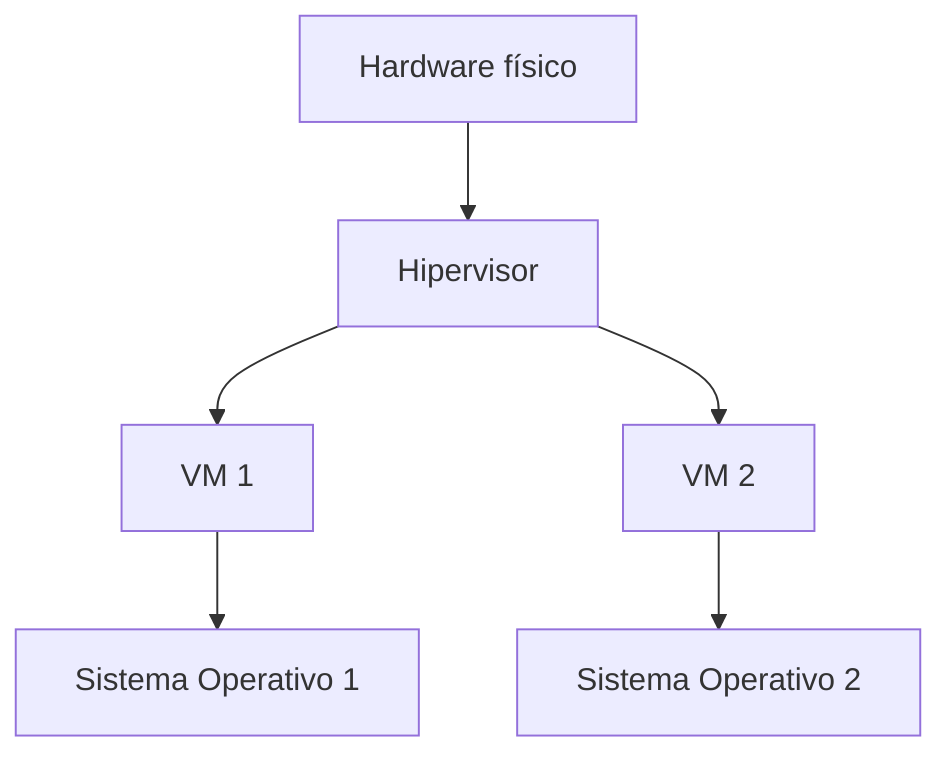

# Artículo 2: ¿Qué es una máquina virtual? 

## Breadcrumb de navegación
Inicio > Artículos > ¿Qué es una máquina virtual?

## Fecha de creación y última actualización
- **Fecha de creación:** 2023-10-02
- **Última actualización:** 2024-06-01

## Tiempo estimado de lectura
- **Tiempo de lectura:** 8 minutos

## Etiquetas
- #Virtualización #MáquinasVirtuales #DevOps #Educativo #Introducción

## Tabla de Contenidos
1. Introducción
2. ¿Qué es una máquina virtual?
   1. Historia y contexto
   2. Arquitectura de una VM
   3. Tipos de hipervisores
3. ¿Cómo funciona una máquina virtual?
   1. Proceso de virtualización
   2. Recursos y aislamiento
   3. Ejemplo de creación de VM
4. Casos de uso comunes
5. Conclusiones

## Introducción
En este artículo aprenderás **qué es una máquina virtual (VM)**, cómo funciona y por qué sigue siendo fundamental en la infraestructura de TI moderna. Las VMs permiten ejecutar múltiples sistemas operativos en un solo hardware físico, proporcionando aislamiento, flexibilidad y compatibilidad con aplicaciones legadas.

## Sección 1: ¿Qué es una máquina virtual?
### 1.1 Historia y contexto
Las primeras máquinas virtuales surgieron en los mainframes de IBM en los años 60. Desde entonces, la virtualización ha evolucionado para soportar servidores, escritorios y entornos en la nube.

### 1.2 Arquitectura de una VM
Una VM es un entorno aislado que simula un hardware completo, permitiendo instalar y ejecutar sistemas operativos y aplicaciones como si fueran equipos físicos independientes.

### 1.3 Tipos de hipervisores
- **Tipo 1 (bare-metal):** Se ejecutan directamente sobre el hardware (ej: VMware ESXi, Microsoft Hyper-V).
- **Tipo 2 (hosted):** Se ejecutan sobre un sistema operativo anfitrión (ej: VirtualBox, VMware Workstation).

## Sección 2: ¿Cómo funciona una máquina virtual?
### 2.1 Proceso de virtualización
El hipervisor asigna recursos físicos (CPU, RAM, disco) a cada VM, gestionando el aislamiento y la seguridad entre ellas.

### 2.2 Recursos y aislamiento
Cada VM tiene su propio sistema operativo, configuraciones y aplicaciones, lo que permite ejecutar entornos completamente diferentes en paralelo.

### 2.3 Ejemplo de creación de VM
Para crear una VM en VirtualBox:
1. Abre VirtualBox y haz clic en "Nueva".
2. Elige el sistema operativo y asigna recursos.
3. Instala el sistema operativo desde una ISO.

## Sección 3: Casos de uso comunes
- Pruebas de sistemas operativos.
- Ejecución de aplicaciones legadas.
- Laboratorios de seguridad y redes.
- Consolidación de servidores.

## Conclusiones
Las máquinas virtuales ofrecen un alto nivel de aislamiento y compatibilidad, siendo ideales para entornos que requieren ejecutar diferentes sistemas operativos o mantener aplicaciones antiguas.

## Elementos Visuales
### Diagrama Conceptual

### Tabla Comparativa
| Elemento      | Descripción                          | Importancia         |
|---------------|--------------------------------------|---------------------|
| Hipervisor    | Software que gestiona las VMs        | Alta                |
| VM            | Entorno virtualizado                 | Alta                |
| Recursos      | CPU, RAM, disco asignados            | Media               |

## Elementos Interactivos

Información adicional

Las VMs pueden migrarse entre servidores físicos sin apagarse, usando tecnologías como vMotion.

Ejemplo detallado

Puedes clonar una VM para crear entornos de prueba idénticos en segundos.

Datos históricos

IBM introdujo la virtualización en mainframes en 1967, sentando las bases de las VMs modernas.

## Referencias y Citas
1. [¿Qué es una máquina virtual? - Red Hat](https://www.redhat.com/es/topics/virtualization/what-is-a-virtual-machine)
2. [Historia de la virtualización - IBM](https://www.ibm.com/cloud/learn/virtual-machines)
3. [VirtualBox Documentation](https://www.virtualbox.org/manual/)

### Notas
- [1] Red Hat. "Virtual Machines". Última consulta: 2024-06-01.
- [2] IBM Cloud. "Virtualization History". Última consulta: 2024-06-01.
- [3] VirtualBox Docs. "User Manual". Última consulta: 2024-06-01.

> "Las máquinas virtuales permiten aprovechar al máximo el hardware disponible."  
> "El aislamiento de las VMs es clave para la seguridad en entornos empresariales."  
> "La virtualización ha transformado la administración de sistemas en las últimas décadas."

## Navegación
- [← Anterior](articulo-1.md)
- [Siguiente →](articulo-3.md)
- [↑ Volver arriba](#qué-es-una-máquina-virtual-🖥️)
- Ver también: [Artículo 1](articulo-1.md), [Artículo 3](articulo-3.md), [Glosario](glosario.md)