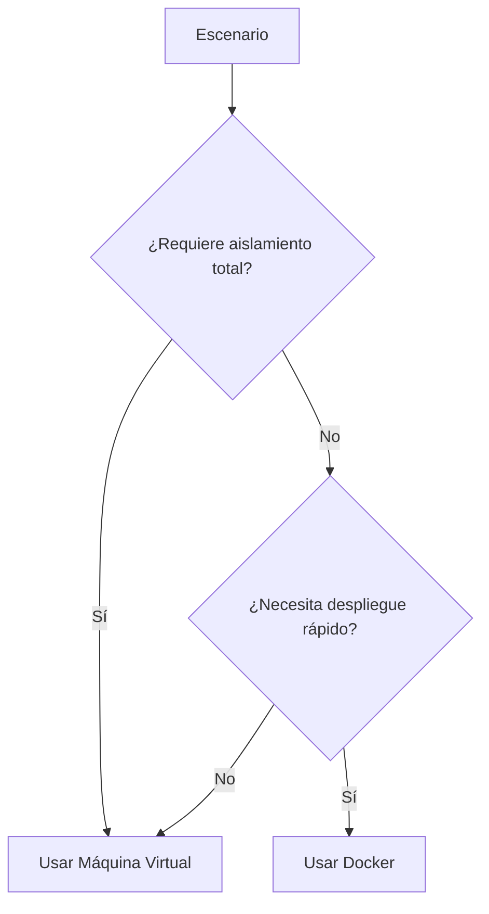
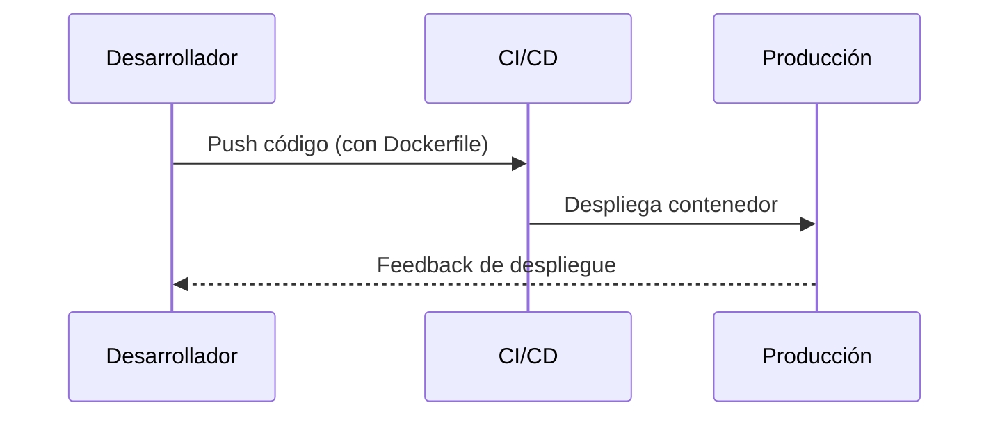

# Artículo 4: Casos de Uso – ¿Cuándo usar Docker y cuándo una Máquina Virtual? 🛠️

## Breadcrumb de Navegación
Inicio > Artículos > Casos de Uso

## Fecha de Creación y Última Actualización
- **Fecha de Creación:** 2023-10-01
- **Última Actualización:** 2023-10-15

## Tiempo Estimado de Lectura
- **Tiempo de Lectura:** 7 minutos

## Etiquetas
- #Contenedores #Virtualización #DevOps #Comparativas #Educativo

## Tabla de Contenidos
1. Introducción
2. Casos de Uso de Docker
   1. Desarrollo Ágil
   2. Pruebas Automatizadas
   3. Microservicios
3. Casos de Uso de Máquinas Virtuales
   1. Entornos Aislados
   2. Infraestructura Legada
   3. Seguridad y Compliance
4. Comparación Práctica
   1. Ejemplo: Despliegue de Aplicación Web
   2. Ejemplo: Laboratorio de Pruebas
   3. Ejemplo: Producción Empresarial
5. Conclusiones

## Introducción
En este artículo analizamos **cuándo conviene usar Docker y cuándo una máquina virtual (VM)**, con ejemplos prácticos y escenarios reales. La elección entre contenedores y VMs depende de factores como el aislamiento, el rendimiento, la facilidad de despliegue y los requisitos de seguridad. Comprender estos casos de uso es esencial para arquitectos de sistemas, desarrolladores y administradores que buscan optimizar sus entornos de trabajo.

Docker ha revolucionado el desarrollo de software al permitir empaquetar aplicaciones y sus dependencias en contenedores ligeros y portables. Por otro lado, las máquinas virtuales ofrecen un entorno completamente aislado, ideal para ejecutar sistemas operativos completos y aplicaciones que requieren un mayor nivel de separación. A continuación, exploramos los escenarios más comunes para cada tecnología, sus ventajas y limitaciones, y cómo elegir la mejor opción según las necesidades del proyecto.

## Sección 1: Casos de Uso de Docker
### Subsección 1.1: Desarrollo Ágil
Docker permite a los desarrolladores crear entornos de desarrollo consistentes y replicables. Por ejemplo, puedes levantar un contenedor con una base de datos y una aplicación web en segundos.

### Subsección 1.2: Pruebas Automatizadas
Los contenedores facilitan la integración continua y las pruebas automatizadas, ya que se pueden crear y destruir rápidamente para cada pipeline.

### Subsección 1.3: Microservicios
Docker es ideal para arquitecturas de microservicios, donde cada servicio corre en su propio contenedor, facilitando el escalado y la actualización independiente.

## Sección 2: Casos de Uso de Máquinas Virtuales
### Subsección 2.1: Entornos Aislados
Las VMs proporcionan un aislamiento total, útil para ejecutar diferentes sistemas operativos o aplicaciones que requieren configuraciones específicas.

### Subsección 2.2: Infraestructura Legada
Muchas empresas aún dependen de aplicaciones antiguas que solo funcionan en ciertos sistemas operativos, lo que hace a las VMs indispensables.

### Subsección 2.3: Seguridad y Compliance
Las VMs ofrecen un entorno más seguro y controlado, ideal para cumplir normativas estrictas o manejar datos sensibles.

## Sección 3: Comparación Práctica
### Subsección 3.1: Ejemplo – Despliegue de Aplicación Web
- **Docker:** Despliegue rápido, bajo consumo de recursos.
- **VM:** Mayor aislamiento, pero más pesado.

### Subsección 3.2: Ejemplo – Laboratorio de Pruebas
- **Docker:** Ideal para pruebas rápidas y desechables.
- **VM:** Mejor para pruebas de sistemas operativos completos.

### Subsección 3.3: Ejemplo – Producción Empresarial
- **Docker:** Escalabilidad y portabilidad.
- **VM:** Robustez y seguridad.

## Conclusiones
En resumen, **Docker** es excelente para desarrollo ágil, pruebas y microservicios, mientras que las **máquinas virtuales** son preferibles para entornos que requieren aislamiento total, compatibilidad con sistemas legados o altos estándares de seguridad. La elección depende del caso de uso y los requisitos específicos del proyecto.

## Elementos Visuales
### Diagrama Conceptual

### Diagrama de Proceso

### Tablas
#### Tabla Comparativa
| Característica | Docker | Máquina Virtual |
|:--------------:|:------:|:---------------:|
| Consumo de recursos | Bajo | Alto |
| Aislamiento | Medio | Alto |
| Velocidad de arranque | Segundos | Minutos |
| Portabilidad | Alta | Media |
| Seguridad | Media | Alta |

#### Tabla de Datos
| Caso de Uso         | Docker | VM |
|---------------------|--------|----|
| Desarrollo          | ✔️     | ✔️ |
| Pruebas rápidas     | ✔️     | ❌ |
| Sistemas legados    | ❌     | ✔️ |
| Alta seguridad      | ❌     | ✔️ |
| Microservicios      | ✔️     | ❌ |

#### Tabla de Resumen
| Aspecto      | Docker | VM |
|--------------|--------|----|
| Facilidad de uso | ⭐⭐⭐⭐ | ⭐⭐⭐ |
| Escalabilidad    | ⭐⭐⭐⭐ | ⭐⭐ |
| Compatibilidad   | ⭐⭐   | ⭐⭐⭐⭐ |

## Elementos Interactivos

Información Adicional

Docker utiliza tecnologías del kernel de Linux como <code>cgroups</code> y <code>namespaces</code> para aislar procesos. Las VMs, en cambio, requieren un hipervisor como VirtualBox o VMware.

Ejemplo Detallado

**Ejemplo Docker:**  
<code>docker run -d -p 80:80 nginx</code>  
Levanta un servidor web Nginx en segundos.

**Ejemplo VM:**  
Crear una VM en VirtualBox, instalar Ubuntu, configurar red y servicios. Proceso más largo, pero con mayor aislamiento.

Datos Históricos

- Docker fue lanzado en 2013 y popularizó el uso de contenedores.
- Las primeras máquinas virtuales surgieron en mainframes de IBM en los años 60.

## Referencias y Citas
1. [Documentación oficial de Docker](https://docs.docker.com)
2. [¿Qué es una máquina virtual? - Red Hat](https://www.redhat.com/es/topics/virtualization/what-is-a-virtual-machine)
3. [Comparativa Docker vs VM - IBM](https://www.ibm.com/cloud/blog/docker-vs-vm)

### Notas
- [1] Docker Docs. "Get Started". Última consulta: 2024-06-01.
- [2] Red Hat. "Virtual Machines". Última consulta: 2024-06-01.
- [3] IBM Cloud. "Docker vs VM". Última consulta: 2024-06-01.

> "Docker cambió la forma en que desarrollamos y desplegamos aplicaciones."  
> "Las máquinas virtuales siguen siendo esenciales para muchos entornos empresariales."  
> "La clave está en elegir la herramienta adecuada para cada necesidad."

## Navegación
- [← Anterior](articulo-3.md)
- [Siguiente →](articulo-5.md)
- [↑ Volver arriba](#casos-de-uso--cuando-usar-docker-y-cuando-una-máquina-virtual-️)
- Ver también: [Artículo 1](articulo-1.md), [Artículo 2](articulo-2.md), [Artículo 3](articulo-3.md)