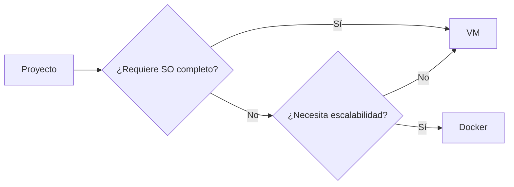
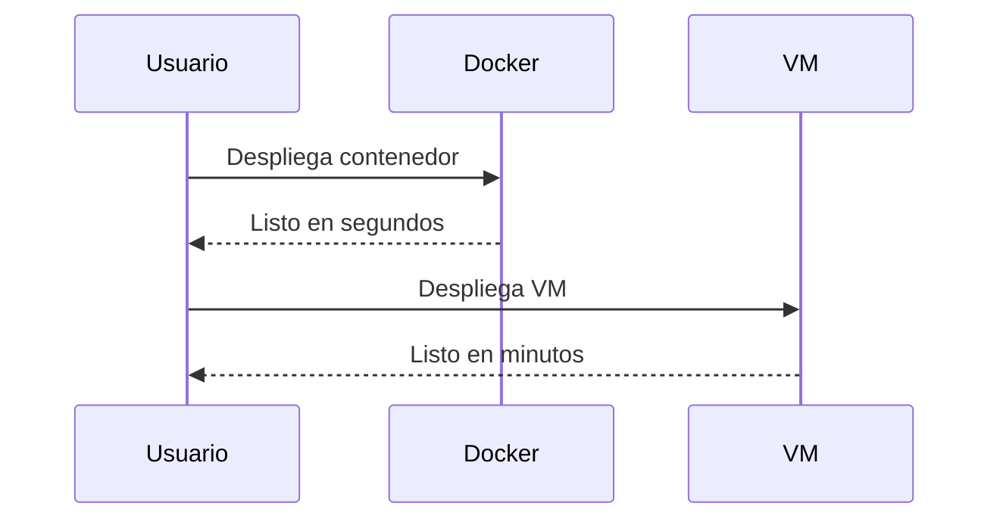

# Artículo 5: Ventajas y desventajas de Docker y máquinas virtuales 🏆⚠️

## Breadcrumb de Navegación
Inicio > Artículos > Ventajas y desventajas

## Fecha de Creación y Última Actualización
- **Fecha de Creación:** 2023-10-05
- **Última Actualización:** 2024-06-01

## Tiempo Estimado de Lectura
- **Tiempo de Lectura:** 7 minutos

## Etiquetas
#Contenedores #Virtualización #Comparativas #Docker #MáquinasVirtuales #Educativo

## Tabla de Contenidos
1. Introducción
2. Ventajas de Docker
   1. Portabilidad
   2. Rapidez y eficiencia
   3. Escalabilidad
3. Ventajas de las máquinas virtuales
   1. Aislamiento total
   2. Compatibilidad
   3. Seguridad
4. Desventajas de Docker y VMs
   1. Limitaciones de Docker
   2. Limitaciones de las VMs
   3. Tabla comparativa
5. Recomendaciones finales

## Introducción
En este artículo se presentan las **ventajas y desventajas** de Docker y las máquinas virtuales (VMs), ayudando a decidir cuál tecnología es más adecuada según el contexto. Se resumen los puntos clave y se ofrecen recomendaciones prácticas para su adopción en proyectos reales.

## Sección 1: Ventajas de Docker
### 1.1 Portabilidad
Los contenedores Docker pueden ejecutarse en cualquier sistema que soporte Docker, facilitando el traslado entre entornos de desarrollo, pruebas y producción.

### 1.2 Rapidez y eficiencia
Docker permite iniciar y detener contenedores en segundos, con un consumo mínimo de recursos.

### 1.3 Escalabilidad
La ligereza de los contenedores facilita el escalado horizontal y la gestión de microservicios.

## Sección 2: Ventajas de las máquinas virtuales
### 2.1 Aislamiento total
Las VMs ofrecen un entorno completamente aislado, ideal para ejecutar diferentes sistemas operativos y proteger aplicaciones críticas.

### 2.2 Compatibilidad
Permiten ejecutar aplicaciones legadas y sistemas operativos antiguos sin modificar el hardware físico.

### 2.3 Seguridad
El aislamiento a nivel de hardware reduce la superficie de ataque y mejora la seguridad en entornos sensibles.

## Sección 3: Desventajas de Docker y VMs
### 3.1 Limitaciones de Docker
- Menor aislamiento comparado con VMs.
- No apto para ejecutar sistemas operativos completos.
- Requiere conocimientos de redes y seguridad de contenedores.

### 3.2 Limitaciones de las VMs
- Mayor consumo de recursos (RAM, CPU, disco).
- Arranque y despliegue más lentos.
- Gestión y mantenimiento más complejos.

### 3.3 Tabla comparativa
| Aspecto                | Docker                   | Máquina Virtual           |
|------------------------|--------------------------|--------------------------|
| Portabilidad           | ⭐⭐⭐⭐                    | ⭐⭐⭐                      |
| Rapidez                | ⭐⭐⭐⭐                    | ⭐⭐                       |
| Aislamiento            | ⭐⭐⭐                     | ⭐⭐⭐⭐                     |
| Compatibilidad         | ⭐⭐                      | ⭐⭐⭐⭐                     |
| Seguridad              | ⭐⭐⭐                     | ⭐⭐⭐⭐                     |
| Consumo de recursos    | Bajo                     | Alto                     |
| Facilidad de gestión   | ⭐⭐⭐⭐                    | ⭐⭐                       |

#### Tabla de Datos
| Tecnología | Arranque | RAM mínima | SO completo | Microservicios | Seguridad |
|------------|----------|------------|-------------|---------------|-----------|
| Docker     | Segundos | ~50MB      | No          | Sí            | Media     |
| VM         | Minutos  | >512MB     | Sí          | No            | Alta      |

#### Tabla de Resumen
| Recomendado para...         | Docker                   | Máquina Virtual           |
|-----------------------------|--------------------------|--------------------------|
| Desarrollo ágil             | ✔️                       | ✔️                       |
| Sistemas legados            | ❌                       | ✔️                       |
| Alta seguridad              | ❌                       | ✔️                       |
| Microservicios              | ✔️                       | ❌                       |

## Recomendaciones finales
- **Usa Docker** para desarrollo ágil, despliegue rápido y microservicios.
- **Usa VMs** para aplicaciones legadas, máxima seguridad o cuando se requiera ejecutar diferentes sistemas operativos.
- Considera arquitecturas híbridas para aprovechar lo mejor de ambos mundos.

## Elementos Visuales
### Diagrama Conceptual

### Diagrama de Proceso

## Elementos Interactivos

Información adicional

Docker y las VMs pueden coexistir en entornos híbridos, combinando portabilidad y aislamiento.

Ejemplo detallado

Un entorno de CI/CD puede usar Docker para pruebas rápidas y VMs para pruebas de integración completas.

Datos históricos

El auge de los contenedores ha impulsado la adopción de arquitecturas basadas en microservicios.

## Referencias y Citas
1. [Comparativa Docker vs VM - IBM](https://www.ibm.com/cloud/blog/docker-vs-vm)
2. [Documentación oficial de Docker](https://docs.docker.com)
3. [¿Qué es una máquina virtual? - Red Hat](https://www.redhat.com/es/topics/virtualization/what-is-a-virtual-machine)

### Notas
- [1] IBM Cloud. "Docker vs VM". Última consulta: 2024-06-01.
- [2] Docker Docs. "Get Started". Última consulta: 2024-06-01.
- [3] Red Hat. "Virtual Machines". Última consulta: 2024-06-01.

> "No existe una solución única: la clave está en combinar tecnologías según el caso de uso."  
> "La virtualización sigue evolucionando para adaptarse a las nuevas demandas del sector TI."  
> "El conocimiento de ambas herramientas es esencial para los profesionales modernos."

## Navegación
[← Anterior](articulo-4.md) | [↑ Volver arriba](#ventajas-y-desventajas-de-docker-y-máquinas-virtuales-️)

### Ver También
- [Artículo 1](articulo-1.md)
- [Artículo 2](articulo-2.md)
- [Artículo 3](articulo-3.md)
- [Artículo 4](articulo-4.md)