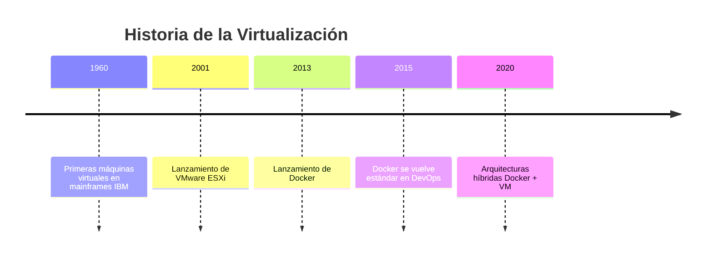
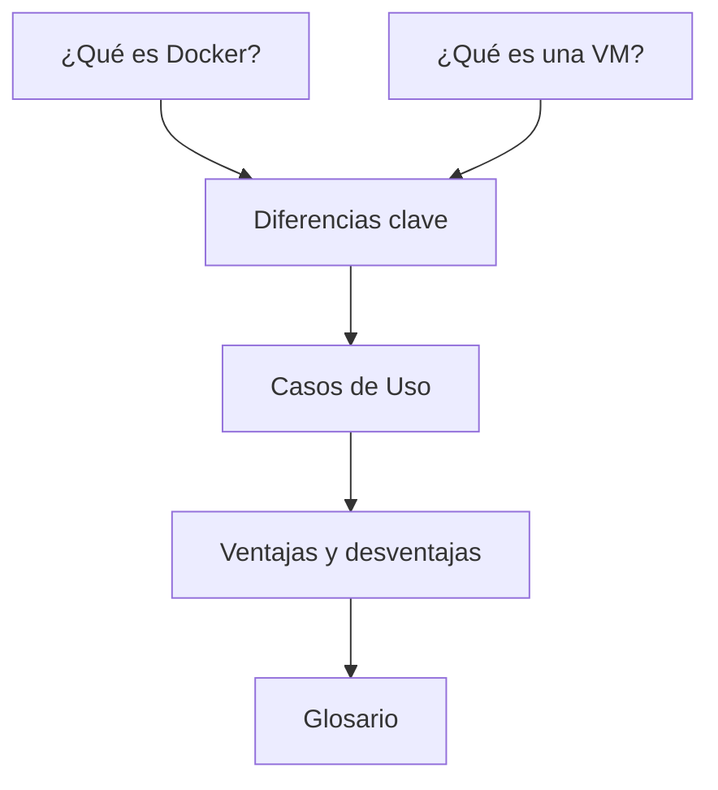

<!-- Banner de bienvenida centrado y original -->

  <h1 style="color: #fff; font-size: 2.8em; margin-bottom: 0.2em;">
    Bienvenido a la Wiki Docker vs. Máquinas Virtuales 🖥️🐳
  </h1>
  <h3 style="color: #e3f2fd; font-weight: 400; margin-top: 0;">
    Comparativa técnica, práctica e histórica de las tecnologías que mueven el mundo moderno.
  </h3>
  

---

## Descripción del proyecto

Esta mini-Wiki está dedicada a **Contenedores Docker vs. Máquinas Virtuales**. Aquí encontrarás artículos interconectados que exploran aspectos técnicos, prácticos e históricos de ambas tecnologías de virtualización, junto con recursos adicionales y un glosario de términos relevantes.

---

## Índice visual de artículos destacados

| Título del Artículo                                              | Enlace              |
|------------------------------------------------------------------|---------------------|
| ¿Qué es Docker y cómo funciona? 🐳                               | [Leer más](articulo-1.md) |
| ¿Qué es una máquina virtual? 🖥️                                 | [Leer más](articulo-2.md) |
| Diferencias clave entre Docker y las máquinas virtuales ⚖️       | [Leer más](articulo-3.md) |
| Casos de Uso: ¿Cuándo usar Docker y cuándo una VM? 🛠️           | [Leer más](articulo-4.md) |
| Ventajas y desventajas de Docker y máquinas virtuales 🏆⚠️        | [Leer más](articulo-5.md) |

---

## Estadísticas del proyecto

| Estadística         | Valor         |
|---------------------|--------------|
| Total de artículos  | 5            |
| Total de palabras   | [Aproximado] |
| Total de diagramas  | 10           |

---

## Últimas actualizaciones

- 2024-06-01 - Artículo 5 actualizado
- 2024-06-01 - Glosario actualizado
- 2024-05-30 - Artículo 3 creado

---

## Timeline general del tema

---

## Mapa conceptual de relaciones entre artículos

---

## Navegación

[Ir al Artículo 1](articulo-1.md) | [Ir al Artículo 2](articulo-2.md) | [Ir al Artículo 3](articulo-3.md) | [Ir al Artículo 4](articulo-4.md) | [Ir al Artículo 5](articulo-5.md) | [Ir al Glosario](glosario.md) | [Ir a Referencias](referencias.md)

---

## Footer

Autor: Luis Hoyos  
Fecha de creación: 2024-06-01

---