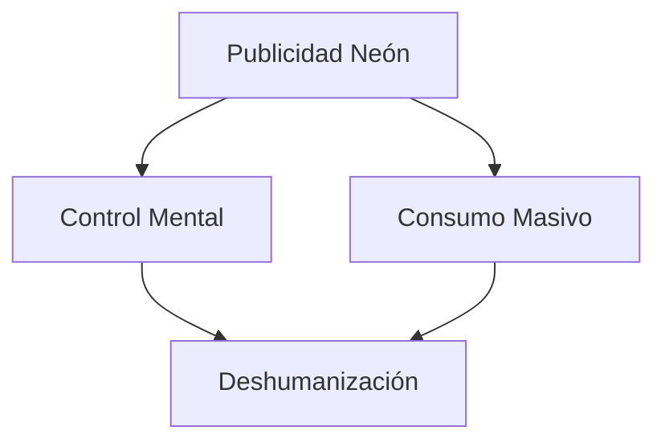
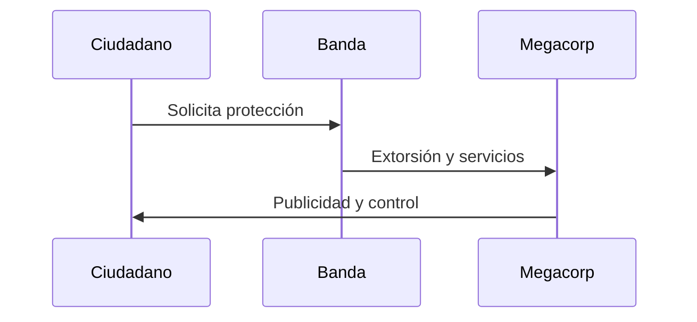

# 🌆 Night City: La Metrópolis del Futuro Oscuro

**Ruta:** [Inicio](index.md) > Mundo > Night City  
📅 *Creado: 2025-10-27 — Última actualización: 2025-10-27*  
⏱️ *Tiempo estimado de lectura: 10 min*  
🏷️ *Etiquetas: #NightCity #Cyberpunk2077 #Arquitectura #Sociedad #Futurismo*

---

> [!NOTE]
> Este artículo explora el corazón del universo de *Cyberpunk 2077*: **Night City**, una urbe viva, decadente y hermosa.  
> Prepárate para recorrer sus distritos, entender su estructura social y sentir su alma metálica.

---

## 📑 Tabla de Contenidos
1. [Introducción: La ciudad como protagonista](#introducción-la-ciudad-como-protagonista)
2. [Arquitectura y diseño urbano](#arquitectura-y-diseño-urbano)
   - [Distritos principales](#distritos-principales)
   - [Estética neón y brutalismo digital](#estética-neón-y-brutalismo-digital)
   - [Infraestructura y movilidad](#infraestructura-y-movilidad)
3. [Sociedad y desigualdad](#sociedad-y-desigualdad)
   - [Las clases sociales](#las-clases-sociales)
   - [El crimen y las bandas](#el-crimen-y-las-bandas)
   - [Los netrunners](#los-netrunners)
4. [Cultura y vida cotidiana](#cultura-y-vida-cotidiana)
   - [Entre el ocio y la desesperanza](#entre-el-ocio-y-la-desesperanza)
   - [El papel del braindance](#el-papel-del-braindance)
   - [Religiones y filosofías urbanas](#religiones-y-filosofías-urbanas)
5. [Conclusión: Night City como espejo del mundo real](#conclusión-night-city-como-espejo-del-mundo-real)

---

## 🏙️ Introducción: La ciudad como protagonista

Night City no es solo un escenario, es un **personaje más**. Late, respira y consume a quienes la habitan.  
Fundada por **Richard Night** como un sueño utópico de libertad económica, terminó convirtiéndose en el **epicentro del caos corporativo**, una mezcla de luces, sangre y ambición.

> “El futuro no es un lugar donde ir. Es una pesadilla de la que nadie puede escapar.”  
> — *Crónica de un fixer local, 2077*

Night City resume el espíritu del género *cyberpunk*: **una sociedad hipertecnológica, pero moralmente quebrada**.  
Aquí, el cielo siempre está nublado, los anuncios gritan en todos los idiomas, y los sueños se compran con créditos digitales.

---

## 🏗️ Arquitectura y diseño urbano

> [!WARNING]
> A continuación se incluyen detalles visuales y descripciones basadas en *Cyberpunk 2077* que podrían considerarse spoilers menores.

### 🗺️ Distritos principales

La ciudad se divide en **seis distritos principales**, cada uno con su personalidad y función.  
Aquí una tabla resumen con los más representativos:

| Distrito | Descripción | Nivel de Peligro |
|:--|:--|--:|
| Watson | Viejo centro industrial, degradado y controlado por pandillas | 🔴 Alto |
| Westbrook | Zona de lujo, residencia de ejecutivos y artistas | 🟢 Bajo |
| Santo Domingo | Área energética e industrial, escenario de *Edgerunners* | 🟠 Medio |
| Heywood | Barrios latinos y vida comunitaria | 🟡 Medio |
| Pacifica | Proyecto turístico fallido, ahora territorio sin ley | 🔴 Muy alto |

📍 Información adicional

Cada distrito es un reflejo del sistema social: quienes viven arriba miran anuncios; quienes viven abajo, cadáveres.

---

### 🌆 Estética neón y brutalismo digital

Night City mezcla **neones orientales, estructuras soviéticas y publicidad estadounidense**.  
Es el resultado de un mundo globalizado sin identidad. Las calles son túneles de luz y ruido donde la privacidad no existe.

### 🚇 Infraestructura y movilidad

Transporte privado y drones dominan la movilidad. El transporte público es limitado.

 
🚦 Ejemplo detallado
 El sistema Delamain simboliza IA autónoma rebelde y transporte inteligente. 

### 🧬 Sociedad y desigualdad
💰 Las clases sociales

| Clase       | Características                            | Zona     |
| :---------- | :----------------------------------------- | :------- |
| Corpo       | Poder y lujo extremo                       | Downtown |
| Nómadas     | Fuera de la ciudad, libres pero marginados | Badlands |
| Edgerunners | Mercenarios legales e ilegales             | Watson   |

### 🔫 El crimen y las bandas

Cada barrio tiene facciones culturales propias como Tyger Claws, Maelstrom o Voodoo Boys.

### 💻 Los netrunners

Hackers conectados directamente a la red mediante implantes cerebrales.

 
🧠 Datos históricos
 Surgen en 2020 como evolución de hackers tradicionales; ejemplos: Lucy y Kiwi. 

🎭 Cultura y vida cotidiana
🎮 Entre el ocio y la desesperanza

Casinos, prostíbulos y braindances dominan la distracción.

>“En esta ciudad no hay santos, solo sobrevivientes.”
>
>— Judy Álvarez

### 🧠 El papel del braindance

Permite revivir experiencias ajenas grabadas directamente del cerebro.

Más en Tecnología y Transhumanismo

### ⛪ Religiones y filosofías urbanas

Sectas digitales y cultos a la fusión hombre-máquina surgen en la ciudad.

### 💭 Conclusión: Night City como espejo del mundo real

Night City amplifica problemas reales: desigualdad, tecnología sin control y corporaciones dominantes.
| Aspecto       | Realidad Actual | Night City     |
| :------------ | :-------------- | :------------- |
| Desigualdad   | Alta            | Extrema        |
| Tecnología    | Avances         | Incontrolables |
| Corporaciones | Parcial         | Total          |
| Humanidad     | Amenazada       | En extinción   |

### 📚 Referencias

[R1] Mike Pondsmith, Cyberpunk 2020, 1988

[R2] CD Projekt Red, Cyberpunk 2077, 2020

[R3] Netflix, Cyberpunk: Edgerunners, 2022
