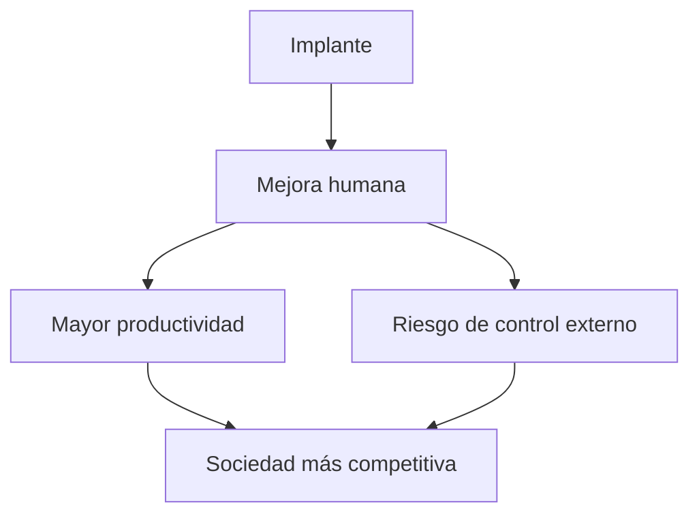
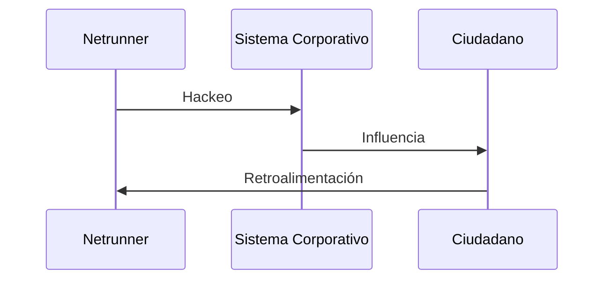

# 🧠 Tecnología y Transhumanismo en el Universo Cyberpunk

**Ruta:** [Inicio](index.md) > Tecnología > Tecnología y Transhumanismo  
📅 *Creado: 2025-10-27 — Última actualización: 2025-10-27*  
⏱️ *Tiempo estimado de lectura: 12 min*  
🏷️ *Etiquetas: #Tecnología #Transhumanismo #Implantes #IA #Cyberpunk2077*

---

> [!NOTE]
> Este artículo analiza cómo la tecnología y el transhumanismo moldean la sociedad de Night City y el universo *Cyberpunk 2077*.

---

## 📑 Tabla de Contenidos
1. [Introducción: La tecnología como extensión humana](#introducción-la-tecnología-como-extensión-humana)
2. [Implantes y ciberware](#implantes-y-ciberware)
   - [Tipos de implantes](#tipos-de-implantes)
   - [Beneficios y riesgos](#beneficios-y-riesgos)
   - [Cultura de la modificación corporal](#cultura-de-la-modificación-corporal)
3. [Inteligencia artificial y redes](#inteligencia-artificial-y-redes)
   - [IA corporativa](#ia-corporativa)
   - [Redes y control social](#redes-y-control-social)
   - [Netrunners y hackers](#netrunners-y-hackers)
4. [Transhumanismo y ética](#transhumanismo-y-ética)
   - [Filosofía de la mejora humana](#filosofía-de-la-mejora-humana)
   - [Conflictos sociales](#conflictos-sociales)
   - [Casos en el juego y anime](#casos-en-el-juego-y-anime)
5. [Conclusión: Futuro incierto](#conclusión-futuro-incierto)
6. [Referencias](#referencias)
7. [Ver también](#ver-también)

---

## Introducción: La tecnología como extensión humana

En Night City, la tecnología no solo sirve para facilitar la vida: **modifica la propia esencia del ser humano**.  
Desde implantes corporales hasta interfaces neuronales, los habitantes se funden con máquinas.  
La línea entre lo humano y lo artificial se vuelve difusa, creando dilemas éticos, sociales y personales.

> “Si tu memoria puede ser hackeada, ¿qué queda de ti?”  
> — *Netrunner anónimo, 2077*

---

## Implantes y ciberware

### Tipos de implantes

| Tipo | Función | Ejemplo en juego |
|:--|:--|:--|
| Neuralware | Aumenta reflejos y capacidades cognitivas | Reflex Booster |
| Cyberlimbs | Sustitución o mejora de extremidades | Brazo reforzado |
| Ópticos | Mejora visual y sensores | Targeting Scope |
| Orgánicos | Mejora interna del cuerpo | Nanotecnología regenerativa |
| Externos | Dispositivos conectados externamente | Drones de vigilancia |

### Beneficios y riesgos

🔧 Información adicional

Los implantes aumentan fuerza, velocidad y percepción, pero pueden causar rechazo, adicción o control externo por corporaciones.

### Cultura de la modificación corporal

El *body hacking* se ha convertido en símbolo de estatus y supervivencia en los barrios bajos y corporativos.

### Inteligencia artificial y redes
IA corporativa

Las megacorporaciones controlan IA que supervisa todo: seguridad, finanzas, logística y comunicación.

### Redes y control social

Los ciudadanos viven conectados; su comportamiento es monitoreado y analizado.

 
💡 Ejemplo detallado
 El sistema Arasaka utiliza IA predictiva para anticipar delitos y manipular mercados. 

Netrunners y hackers

Los netrunners utilizan implantes neuronales para infiltrarse en sistemas corporativos y redes públicas.

### Transhumanismo y ética
Filosofía de la mejora humana

El transhumanismo busca superar las limitaciones biológicas mediante tecnología.
Preguntas éticas emergen: ¿es justo mejorar solo a quienes pueden pagar?

### Conflictos sociales

La brecha entre los que tienen acceso a mejoras y los que no crea tensiones y desigualdad.

Casos en el juego y anime

- Lucy (Edgerunners): implantes neuronales y habilidades sobrehumanas.

- V (Cyberpunk 2077): opción de modificar cuerpo y mente, con consecuencias narrativas.

### Conclusión: Futuro incierto

La fusión humano-tecnología redefine identidad, moral y poder.
Night City es un laboratorio social donde lo posible y lo ético chocan constantemente.

| Aspecto        | Beneficios                   | Riesgos                     |
| :------------- | :--------------------------- | :-------------------------- |
| Implantes      | Fuerza, reflejos, percepción | Adicción, control externo   |
| IA             | Automatización, eficiencia   | Vigilancia, manipulación    |
| Transhumanismo | Superación de límites        | Desigualdad, dilemas éticos |

### Referencias

[R1] CD Projekt Red, Cyberpunk 2077, 2020

[R2] Netflix, Cyberpunk: Edgerunners, 2022

[R3] Mike Pondsmith, Cyberpunk 2020, 1988
