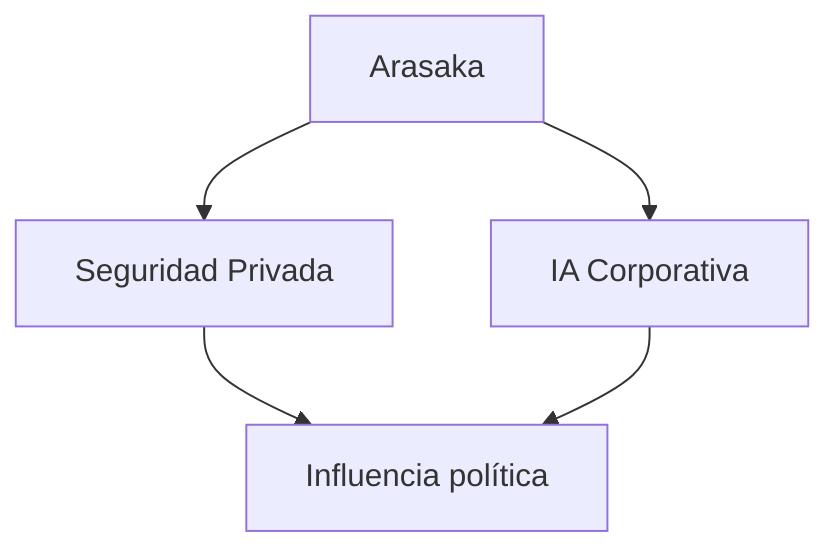
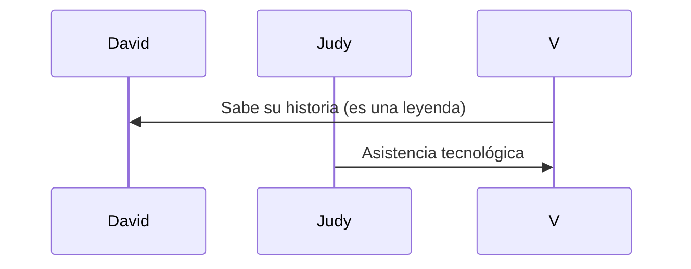

# 🕶️ Personajes y Corporaciones: Poder en las Sombras

**Ruta:** [Inicio](index.md) > Personajes > Personajes y Corporaciones  
📅 *Creado: 2025-10-27 — Última actualización: 2025-10-27*  
⏱️ *Tiempo estimado de lectura: 12 min*  
🏷️ *Etiquetas: #Personajes #Corporaciones #Bandas #Poder #Cyberpunk2077*

---

> [!NOTE]
> Este artículo analiza la jerarquía social y corporativa en Night City, así como los personajes más influyentes en el juego y el anime *Edgerunners*.

---

## 📑 Tabla de Contenidos
1. [Introducción: El poder en Night City](#introducción-el-poder-en-night-city)
2. [Megacorporaciones](#megacorporaciones)
   - [Arasaka](#arasaka)
   - [Militech](#militech)
   - [Otras corporaciones](#otras-corporaciones)
3. [Bandas y grupos criminales](#bandas-y-grupos-criminales)
   - [Tyger Claws](#tyger-claws)
   - [Voodoo Boys](#voodoo-boys)
   - [Maelstrom](#maelstrom)
4. [Personajes clave](#personajes-clave)
   - [V](#v)
   - [Judy Álvarez](#judy-álvarez)
   - [David Martinez](#david-martinez)
5. [Conclusión: Poder, influencia y conflicto](#conclusión-poder-influencia-y-conflicto)
6. [Referencias](#referencias)
7. [Ver también](#ver-también)

---

## Introducción: El poder en Night City

Night City es un tablero donde los **poderosos manipulan y controlan** el destino de los ciudadanos.  
Megacorporaciones, bandas y netrunners conforman un ecosistema de **influencia y supervivencia**.

> “No hay héroes en esta ciudad. Solo piezas que se mueven en un tablero gigante.”  
> — *Diario de un fixer, 2077*

---

## Megacorporaciones

### Arasaka

Arasaka es una corporación japonesa de seguridad y tecnología.  
Controla infraestructura crítica y ejerce **poder político y militar**.

### Militech

Militech maneja armas, vehículos y sistemas de seguridad.
Se enfrenta constantemente a Arasaka por el control de recursos y territorios.

### Otras corporaciones

- Biotechnica: biotecnología y transhumanismo

- Kang Tao: armas de alta tecnología

- Petrochem: energía y logística

## Bandas y grupos criminales

### Tyger Claws

Orientados al crimen organizado y tráfico de drogas. Controlan barrios específicos como Kabuki.

### Voodoo Boys

Expertos en hacking y control de la red. Su territorio principal es el distrito Watson.

### Maelstrom

Violentos y caóticos, obsesionados con la modificación corporal extrema y armas cibernéticas.

 
💡 Información adicional
 Cada banda refleja la cultura y los problemas sociales de los distritos en los que operan. 

## Personajes clave
### V

Protagonista jugable del juego, con múltiples opciones de desarrollo según decisiones.
Su historia se cruza con corporaciones, bandas y netrunners.

### Judy Álvarez

Netrunner experta en braindance. Representa la voz de los marginados y el activismo digital.

### David Martinez

Protagonista de Edgerunners. Joven que se adentra en el mundo de los implantes y el crimen para sobrevivir.

## Conclusión: Poder, influencia y conflicto

Night City funciona como un ecosistema de poder: corporaciones controlan recursos, bandas imponen territorio y los personajes luchan por sobrevivir y ascender.

| Elemento      | Influencia    | Riesgo                       |
| :------------ | :------------ | :--------------------------- |
| Corporaciones | Máxima        | Manipulación, violencia      |
| Bandas        | Media         | Conflicto constante          |
| Netrunners    | Variable      | Hackeo y represalias         |
| Protagonistas | Personalizada | Decisiones con consecuencias |

Referencias

- CD Projekt Red, Cyberpunk 2077, 2020

- Netflix, Cyberpunk: Edgerunners, 2022

- Mike Pondsmith, Cyberpunk 2020, 1988
