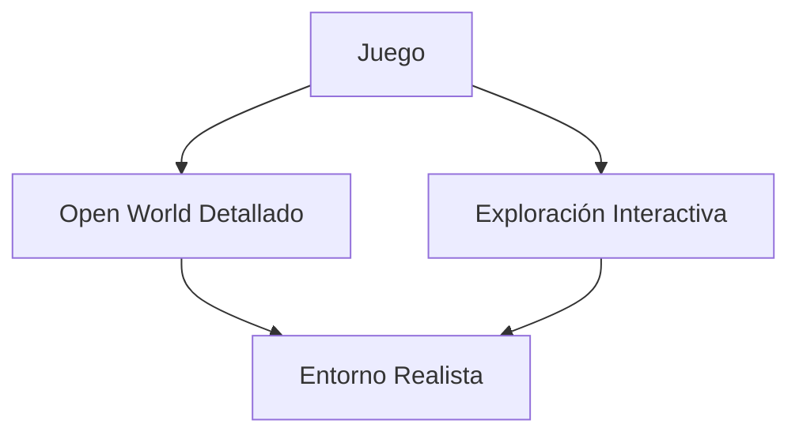
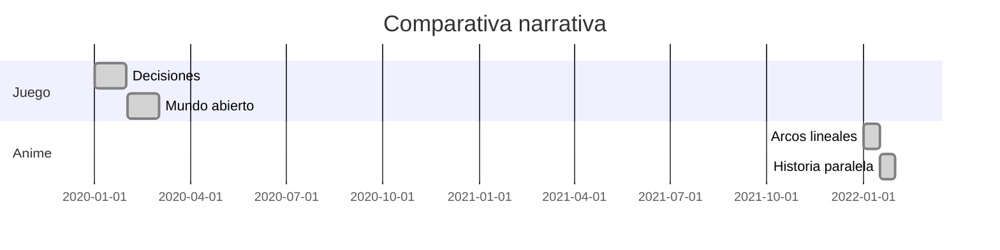

# 🎞️ Narrativa y Estética: Del Juego al Anime

**Ruta:** [Inicio](index.md) > Narrativa > Narrativa y Estética  
📅 *Creado: 2025-10-27 — Última actualización: 2025-10-27*  
⏱️ *Tiempo estimado de lectura: 12 min*  
🏷️ *Etiquetas: #Narrativa #Anime #Juego #Estética #Cyberpunk2077*

---

> [!NOTE]
> Este artículo analiza cómo la narrativa y la estética de *Cyberpunk 2077* se trasladan al anime *Edgerunners*, destacando coincidencias, diferencias y evolución del estilo.

---

## 📑 Tabla de Contenidos
1. [Introducción: De juego a anime](#introducción-de-juego-a-anime)
2. [Estética visual](#estética-visual)
   - [Diseño de personajes](#diseño-de-personajes)
   - [Entornos y ciudades](#entornos-y-ciudades)
   - [Colores y luz](#colores-y-luz)
3. [Narrativa y estructura](#narrativa-y-estructura)
   - [Historias paralelas](#historias-paralelas)
   - [Arcos de personajes](#arcos-de-personajes)
   - [Tono y temas recurrentes](#tono-y-temas-recurrentes)
4. [Elementos comunes y divergencias](#elementos-comunes-y-divergencias)
   - [Similitudes](#similitudes)
   - [Diferencias clave](#diferencias-clave)
   - [Impacto en la percepción del universo](#impacto-en-la-percepción-del-universo)
5. [Conclusión: La riqueza narrativa transmedia](#conclusión-la-riqueza-narrativa-transmedia)
6. [Referencias](#referencias)
7. [Ver también](#ver-también)

---

## Introducción: De juego a anime

*Cyberpunk 2077* establece un mundo abierto con enfoque en exploración y decisiones del jugador. *Edgerunners* toma ese universo y lo traduce a **una narrativa lineal**, con énfasis en personajes jóvenes que enfrentan problemas de supervivencia y ética.

> “El anime no reemplaza al juego, sino que amplifica su narrativa y estética.”  
> — *Crítico de medios, 2022*

---

## Estética visual

### Diseño de personajes

Los personajes de *Edgerunners* mantienen **rasgos y estilo cyberpunk**, pero adaptados a animación japonesa, con exageraciones estilísticas y expresiones dramáticas.

### Entornos y ciudades

Night City en el anime respira vida, movimiento y neonismo similar al juego, aunque simplificado para animación fluida.

### Colores y luz

Paleta saturada, neon y contraste extremo son constantes en ambos medios.

 
💡 Datos curiosos
 El anime usa técnicas de iluminación inspiradas en CGI del juego para mantener coherencia estética. 

## Narrativa y estructura
### Historias paralelas

El anime presenta historias independientes pero conectadas con eventos y corporaciones del juego.

### Arcos de personajes

Cada protagonista enfrenta elecciones morales, reflejando decisiones que un jugador podría tomar en el juego.

### Tono y temas recurrentes

Corrupción, desigualdad, transhumanismo y amistad son temas que cruzan ambos medios.

## Elementos comunes y divergencias
### Similitudes

- Megacorporaciones y bandas

- Estética cyberpunk: neon, lluvia, caos urbano

- Tecnología y transhumanismo

### Diferencias clave

- Anime: narrativa lineal y enfoque en personajes específicos

- Juego: narrativa abierta y múltiples finales posibles

### Impacto en la percepción del universo

El anime refuerza el lore, permitiendo comprender mejor las motivaciones de personajes y el funcionamiento de Night City.

### Conclusión: La riqueza narrativa transmedia

El universo Cyberpunk gana profundidad gracias a la coexistencia de juego y anime, permitiendo distintos puntos de vista sobre Night City y sus habitantes.

| Medio | Fortalezas                   | Limitaciones                             |
| :---- | :--------------------------- | :--------------------------------------- |
| Juego | Interactividad, exploración  | Requiere tiempo y decisiones del jugador |
| Anime | Narrativa lineal y emocional | Menos libertad y exploración             |

## Referencias

- CD Projekt Red, Cyberpunk 2077, 2020

- Netflix, Cyberpunk: Edgerunners, 2022

- William Gibson, Neuromante, 1984
