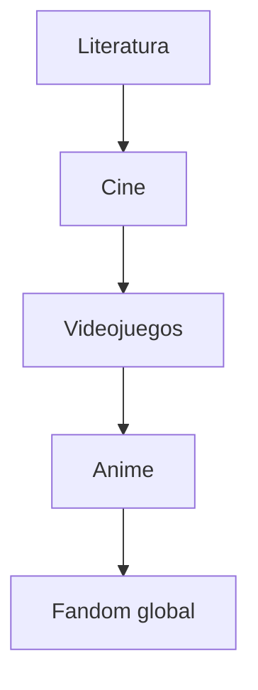
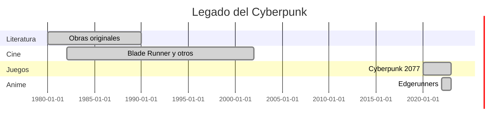

# 💥 Impacto Cultural y Filosofía Cyberpunk

**Ruta:** [Inicio](index.md) > Filosofía > Impacto Cultural y Filosofía  
📅 *Creado: 2025-10-27 — Última actualización: 2025-10-27*  
⏱️ *Tiempo estimado de lectura: 12 min*  
🏷️ *Etiquetas: #Cultura #Filosofía #Influencia #Cyberpunk2077 #Edgerunners*

---

> [!NOTE]
> Este artículo explora el impacto cultural y filosófico del universo Cyberpunk en la sociedad, desde su influencia en medios hasta debates éticos sobre tecnología y transhumanismo.

---

## 📑 Tabla de Contenidos
1. [Introducción: Cyberpunk como fenómeno cultural](#introducción-cyberpunk-como-fenómeno-cultural)
2. [Influencias en medios y arte](#influencias-en-medios-y-arte)
   - [Literatura](#literatura)
   - [Cine y series](#cine-y-series)
   - [Videojuegos y animación](#videojuegos-y-animación)
3. [Filosofía y ética](#filosofía-y-ética)
   - [Transhumanismo](#transhumanismo)
   - [Desigualdad y poder](#desigualdad-y-poder)
   - [El papel de la tecnología](#el-papel-de-la-tecnología)
4. [Legado y debates contemporáneos](#legado-y-debates-contemporáneos)
   - [Impacto social](#impacto-social)
   - [Comunidad y fandom](#comunidad-y-fandom)
   - [Futuro del cyberpunk](#futuro-del-cyberpunk)
5. [Conclusión: Reflexiones finales](#conclusión-reflexiones-finales)
6. [Referencias](#referencias)
7. [Ver también](#ver-también)

---

## Introducción: Cyberpunk como fenómeno cultural

Cyberpunk trasciende videojuegos y anime; es un **movimiento cultural** que cuestiona la relación entre tecnología, sociedad y ética.  
Desde *Neuromante* hasta *Edgerunners*, la narrativa cyberpunk refleja la tensión entre libertad individual y control corporativo.

> “El cyberpunk no predice el futuro; lo exagera para que lo veamos claramente.”  
> — *Estudioso de medios digitales, 2022*

---

## Influencias en medios y arte

### Literatura

El género se originó con novelas de William Gibson y Bruce Sterling, mostrando futuros distópicos y tecnología avanzada.

### Cine y series

Películas como *Blade Runner* y series como *Altered Carbon* consolidan el estilo visual y los temas del género.

### Videojuegos y animación

*Cyberpunk 2077* y *Edgerunners* expanden la narrativa interactiva y transmedia del género.

## Filosofía y ética
### Transhumanismo

Explora los límites de la modificación humana y las implicaciones morales de la fusión hombre-máquina.

### Desigualdad y poder

El cyberpunk muestra cómo la tecnología puede exacerbar diferencias sociales, creando un mundo de opresión y marginalidad.

### El papel de la tecnología

Desde implantes hasta IA, la tecnología puede empoderar o controlar, dependiendo de quién la gestione.

 
💡 Información adicional
 En Night City, cada avance tecnológico tiene un doble filo: libertad o control corporativo. 

## Legado y debates contemporáneos
### Impacto social

El género ha inspirado debates sobre ética en IA, vigilancia y privacidad digital.

### Comunidad y fandom

Comunidades globales discuten lore, mods, teorías y fanarts, fortaleciendo la cultura cyberpunk.

### Futuro del cyberpunk

El género sigue evolucionando con nuevas plataformas, VR, IA y narrativa transmedia.

### Conclusión: Reflexiones finales

El universo Cyberpunk nos invita a reflexionar sobre ética, poder, desigualdad y tecnología.
Su legado trasciende entretenimiento, influenciando pensamiento crítico y cultura digital.

| Aspecto    | Impacto              | Comentario                           |
| :--------- | :------------------- | :----------------------------------- |
| Cultura    | Global               | Literatura, cine, anime, videojuegos |
| Filosofía  | Ética y moral        | Transhumanismo y desigualdad         |
| Tecnología | Innovación y control | IA, implantes, redes                 |

## Referencias

- CD Projekt Red, Cyberpunk 2077, 2020

- Netflix, Cyberpunk: Edgerunners, 2022

- William Gibson, Neuromante, 1984

- Bruce Sterling, Islands in the Net, 1988
