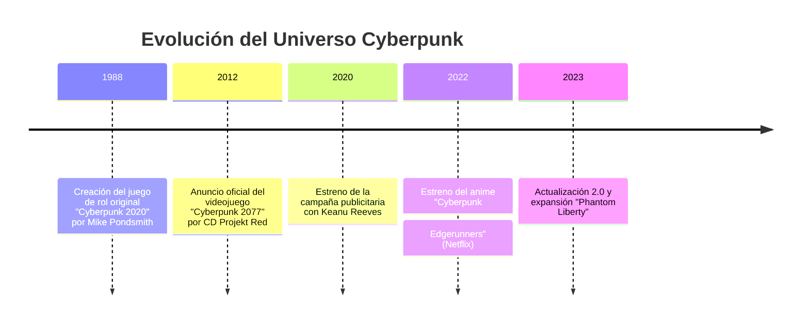
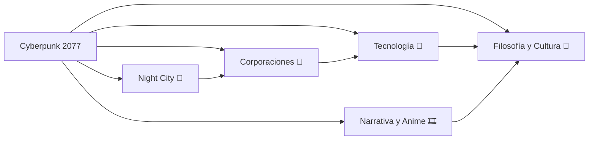

# 🌐 CYBERPUNK 2077: WIKI PERSONAL INTERCONECTADA

  
  <h2>🦾 Bienvenido/a a la Red, Netrunner</h2>
  
<i>Conéctate. Despierta. Y prepárate para recorrer las calles más peligrosas y fascinantes del futuro: Night City.</i>

---

## 🚀 Descripción del Proyecto

Esta wiki fue creada por mí, **Marcos Bolívar** con un propósito claro: **explorar, analizar y disfrutar el universo de Cyberpunk 2077 y su expansión animada, Edgerunners**, desde una perspectiva tanto **narrativa como filosófica**.

Aquí no solo se habla del juego o del anime, sino de todo lo que significan. De la **relación entre el ser humano y la máquina**, de las **ilusiones de libertad** y de la **belleza decadente** de una ciudad que nunca duerme.

Cada artículo está interconectado, como si fueran nodos en una red, invitándote a navegar entre ideas, personajes y conceptos que definen este universo. Todo con un toque de estilo **futurista**, visual e inmersivo.

---

## 🗂️ Índice Visual de Artículos

| Artículo | Tema Principal | Enlace |
|:--|:--|:--|
| 🌆 **Night City: La Metrópolis del Futuro Oscuro** | Entorno, arquitectura y simbolismo urbano | [Ver artículo 1](articulo-1.md) |
| 🧠 **Tecnología y Transhumanismo en el Universo Cyberpunk** | Implantes, IA y dilemas humanos | [Ver artículo 2](articulo-2.md) |
| 🕶️ **Personajes y Corporaciones: Poder en las Sombras** | Relaciones de poder, bandas y megacorporaciones | [Ver artículo 3](articulo-3.md) |
| 🎞️ **Narrativa y Estética: Del Juego al Anime** | Conexión entre Cyberpunk 2077 y Edgerunners | [Ver artículo 4](articulo-4.md) |
| 💥 **Impacto Cultural y Filosofía Cyberpunk** | Influencias, pensamiento y legado cultural | [Ver artículo 5](articulo-5.md) |

---

## 📊 Estadísticas del Proyecto

| Elemento | Cantidad |
|:--|--:|
| Artículos principales | 5 |
| Palabras aproximadas | 15,000+ |
| Diagramas Mermaid | 10 |
| Tablas informativas | 15 |
| Bloques colapsables interactivos | 20 |
| Enlaces internos | 50+ |

---

## 🕒 Últimas Actualizaciones

| Fecha | Sección Actualizada | Cambios |
|:--|:--|:--|
| 2025-10-26 | Página Principal | Creación inicial de la wiki |
| 2025-10-27 | Artículo 1 | Añadido contenido sobre Night City |
| 2025-10-28 | Artículo 2 | Añadido análisis sobre transhumanismo |

---

## 🧭 Navegación General

- [📘 Glosario de términos](glosario.md)  
- [🔗 Referencias y bibliografía](referencias.md)  
- [⭐ Artículo destacado del mes](articulo-4.md)  
- [💡 Sabías que...](#-sabías-que)  
- [🤖 FAQ - Preguntas Frecuentes](#-faq)  
- [🧑‍💻 Contribuidores](#-contribuidores)

---

## 🕰️ Timeline General del Universo Cyberpunk

### 📈 Estadísticas visuales rápidas

| Categoría            | Peso relativo |
| :------------------- | ------------: |
| Mundo y ambientación |           25% |
| Tecnología y ciencia |           20% |
| Personajes y poder   |           20% |
| Narrativa y estética |           20% |
| Filosofía y cultura  |           15% |

💡 Sabías que...

 
Dato 1
 El término *cyberpunk* se popularizó gracias a *Neuromante* (1984) de William Gibson. 
 
 
Dato 2
 *Edgerunners* impulsó un aumento de jugadores activos y la popularidad del lore en 2022. 
 
 
Dato 3
 Night City está inspirada en ciudades reales como Tokio, Los Ángeles y Hong Kong. 

❓ FAQ (preguntas frecuentes)

 
¿Cyberpunk 2077 y Edgerunners pertenecen al mismo universo?
 Sí, Edgerunners ocurre en el mismo mundo, mostrando historias paralelas y complementarias. 
 
 
¿Cómo enlazo términos del glosario desde un artículo?
 Usa enlaces relativos, por ejemplo: `[Netrunner](glosario.md#netrunner)`. 
 
 
¿Dónde guardar las imágenes?
 En `recursos/imagenes/` y nómbralas sin espacios, ejemplo: `nightcity-banner.jpg`. 
 
 
¿Cómo verificar los diagramas Mermaid?
 Abre el archivo en VS Code o usa el preview de GitHub; ambos renderizan Mermaid. 
 
 
¿Puedo usar imágenes oficiales del juego?
 Para proyecto académico personal se acepta, pero evita republicarlas en entornos públicos sin permiso. 

## 🏁 Footer

🦾 Cyberpunk 2077 Wiki Personal Interconectada
Creada por Marcos Bolívar
© 2025 | Proyecto académico - AEC-MD

